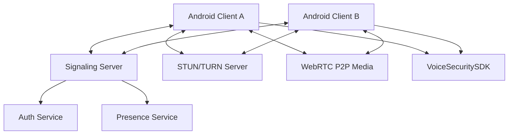

# Architecture Overview - Anti-clone Voice

## System Components

1. **Android Client (Kotlin)**: The main user interface for VoIP calling, integrating the VoiceSecuritySDK. Located in `AndroidApp/`.
2. **Backend (REST/gRPC)**: Handles authentication, user presence, and signaling for WebRTC. Located in `Backend/`.
3. **VoiceSecuritySDK**: A specialized library for real-time deepfake voice detection and anti-cloning verification. Located in `VoiceSecuritySDK/`.
4. **Signaling Server**: Facilitates WebRTC handshakes (SDP exchange, ICE candidates) between peers.
5. **STUN/TURN Servers**: Necessary for P2P connectivity through NAT/Firewalls.
    - **STUN**: Used to discover public IP/Port. (Using Google free STUN).
    - **TURN**: Used when direct P2P or STUN fail. Relay traffic through the server.
    - **Strategy**: UDP -> TCP -> TLS (fallback) to ensure connectivity behind strict firewalls.

## TURN Server Configuration (coturn)
To ensure connectivity across all networks, a `coturn` server should be deployed.
- **Ports**: 3478 (UDP/TCP), 5349 (TLS).
- **Authentication**: Long-term credentials or REST API auth.
- **Config Example**:
  ```conf
  listening-port=3478
  tls-listening-port=5349
  realm=yourdomain.com
  user=username:password
  fingerprint
  lt-cred-mech
  ```

## Mermaid Diagram


## Tech Choices & Justifications

- **Kotlin (Android App)**: Chosen for its modern syntax, safety features, and official support from Google, ensuring high productivity and maintainability.
- **WebRTC**: The industry standard for low-latency, peer-to-peer real-time communication, providing built-in echo cancellation and noise suppression.
- **gRPC (Signaling)**: Offers highly efficient, strongly typed communication using Protocol Buffers, ideal for low-latency signaling state machines.
- **Ktor (Backend)**: A lightweight, asynchronous framework built on Kotlin coroutines, providing excellent performance for signaling and user management.
- **Frequency/Neural Analysis (VoiceSecuritySDK)**: Justified by the need to distinguish synthetic artifacts in real-time audio streams to prevent cloning attacks.

## Auth Flow
1. **Signup**: Client sends username/password to `/api/v1/signup`. Backend hashes password and stores user.
2. **Login**: Client sends credentials to `/api/v1/login`. Backend verifies and returns a signed JWT.
3. **Secure Storage**: Client stores JWT in `EncryptedSharedPreferences`.
4. **Authorized Requests**: Client includes `Authorization: Bearer <token>` header for protected endpoints (e.g., Profile, Signaling).
- Johnston, A. B., & Burnett, D. C. (2012). *WebRTC: APIs and RTCWEB Protocols of the HTML5 Real-Time Web*.
- Indrasiri, K., & Kuruppu, D. (2020). *gRPC: Up and Running*. O'Reilly Media.
