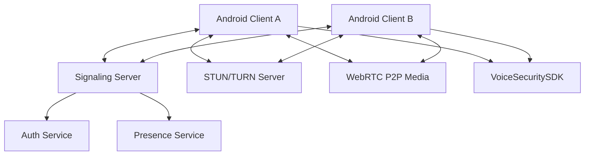

# Architecture Overview - Anti-clone Voice

## System Components

1. **Android Client (Kotlin)**: The main user interface for VoIP calling, integrating the VoiceSecuritySDK. Located in `AndroidApp/`.
2. **Backend (REST/gRPC)**: Handles authentication, user presence, and signaling for WebRTC. Located in `Backend/`.
3. **VoiceSecuritySDK**: A specialized library for real-time deepfake voice detection and anti-cloning verification. Located in `VoiceSecuritySDK/`.
4. **Signaling Server**: Facilitates WebRTC handshakes (SDP exchange, ICE candidates) between peers.
5. **STUN/TURN Servers**: Necessary for P2P connectivity through NAT/Firewalls.
    - **STUN**: Used to discover public IP/Port. (Using Google free STUN).
    - **TURN**: Used when direct P2P or STUN fail. Relay traffic through the server.
    - **Strategy**: UDP -> TCP -> TLS (fallback) to ensure connectivity behind strict firewalls.

## TURN Server Configuration (coturn)
To ensure connectivity across all networks, a highly available `coturn` server cluster is deployed with UDP, TCP, and TLS fallbacks.
- **Ports**: 3478 (UDP/TCP), 5349 (TLS fallback for strict corporate firewalls).
- **Authentication**: Long-term credentials (`lt-cred-mech`) or ephemeral REST API auth tokens.
- **Failover / Cluster Policy**: Primary and secondary TURN nodes are distributed across availability zones, synchronized via a shared Redis database backend for active sessions and credentials.

### Production coturn Configuration Example (`/etc/turnserver.conf`)
```conf
# Network configuration
listening-port=3478
tls-listening-port=5349
listening-ip=0.0.0.0
external-ip=198.51.100.1  # Public IP of the node

# Security & TLS
realm=turn.anticlonevoice.com
cert=/etc/letsencrypt/live/turn.anticlonevoice.com/fullchain.pem
pkey=/etc/letsencrypt/live/turn.anticlonevoice.com/privkey.pem
tls-13
fingerprint
lt-cred-mech

# Transports & Fallbacks
no-multicast-loopback
no-tlsv1
no-tlsv11

# Performance and Clustering
max-bps=0
bps-capacity=0
redis-userdb="host=127.0.0.1 port=6379"
```

## Mermaid Diagram


## Tech Choices & Justifications

- **Kotlin (Android App)**: Chosen for its modern syntax, safety features, and official support from Google, ensuring high productivity and maintainability.
- **WebRTC**: The industry standard for low-latency, peer-to-peer real-time communication, providing built-in echo cancellation and noise suppression.
- **gRPC (Signaling)**: Offers highly efficient, strongly typed communication using Protocol Buffers, ideal for low-latency signaling state machines.
- **Ktor (Backend)**: A lightweight, asynchronous framework built on Kotlin coroutines, providing excellent performance for signaling and user management.
- **Frequency/Neural Analysis (VoiceSecuritySDK)**: Justified by the need to distinguish synthetic artifacts in real-time audio streams to prevent cloning attacks.

## Auth Flow
1. **Signup**: Client sends username/password to `/api/v1/signup`. Backend hashes password and stores user.
2. **Login**: Client sends credentials to `/api/v1/login`. Backend verifies and returns a signed JWT.
3. **Secure Storage**: Client stores JWT in `EncryptedSharedPreferences`.
4. **Authorized Requests**: Client includes `Authorization: Bearer <token>` header for protected endpoints (e.g., Profile, Signaling).

## Media Encryption & Privacy Control
To guarantee absolute conversational privacy and prevent man-in-the-middle sniffing, Anti-clone Voice relies on native standard WebRTC cryptographic primitives layered over secure media protocols.

### 1. Mandatory DTLS-SRTP Transport Protocol
All peer-to-peer real-time streams are protected natively via **DTLS-SRTP (Datagram Transport Layer Security for Secure Real-time Transport Protocol)**. 
- **Handshake Mechanism**: During signaling negotiation, the fingerprint of the self-signed X.509 certificate generated by each app instance is shared via SDP. Once ICE candidate connection pairs are established, a secure DTLS handshake takes place directly between the devices.
- **Cipher Negotiation**: Key material generated from the DTLS handshake is directly passed into the SRTP stack to encrypt and authenticate the voice frames. The stack negotiates highly secure modern cryptographic suites, primarily:
  - **DTLS Cipher Suite**: `TLS_ECDHE_ECDSA_WITH_AES_128_GCM_SHA256` or `TLS_ECDHE_RSA_WITH_AES_128_GCM_SHA256`
  - **SRTP Cipher Suite**: `SRTP_AEAD_AES_128_GCM` or `SRTP_AES128_CM_HMAC_SHA1_80`
- **Network Captures (Wireshark/tcpdump)**: Audio streaming payloads captured over local routers or public carrier gateways appear as fully randomized ciphertext chunks, rendering network packet sniffers obsolete.

### 2. Live Verification Diagnostics
The application actively monitors transport integrity by querying the native WebRTC stats tree (`getStats`). Every 2 seconds, the client checks and logs the active parameters under the `transport` node profile block to ensure cryptographic keys have been applied correctly:
```kotlin
// Verification Logging Verification Hook
Log.i(TAG, "Security Encryption -> WebRTC DTLS-SRTP Active: true, DTLS Cipher: $dtlsCipher, SRTP Cipher: $srtpCipher")
```

- Johnston, A. B., & Burnett, D. C. (2012). *WebRTC: APIs and RTCWEB Protocols of the HTML5 Real-Time Web*.
- Indrasiri, K., & Kuruppu, D. (2020). *gRPC: Up and Running*. O'Reilly Media.
